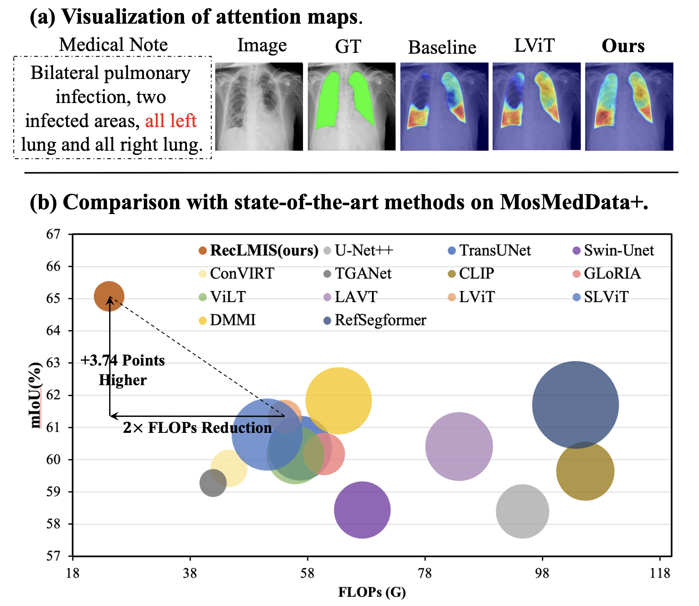

<h2 align="center"> <a href="">RecLMIS: Cross-Modal Conditioned Reconstruction for Language-guided Medical Image Segmentation</a></h2>
<a src="https://img.shields.io/badge/cs.CV-2312.09278-b31b1b?logo=arxiv&logoColor=red" href="https://arxiv.org/pdf/2404.02845"> 
</a> 

<h5 align="center"> 🍒🍒🍒 This paper was accepted by IEEE Transactions on Medical Imaging (TMI).  If you like our project, please give us a star ⭐ on GitHub for latest update. 


# 😮 Hightlights
- ✨ We present an efficient language-guided medical image segmentation framework, which employs conditioned contrastive learning and cross-modal conditioned reconstruction to achieve fine-grained cross-modal alignment.
- ✨ We introduce the conditioned interaction module. It focuses on the key feature token information aligned between images and text, and we have demonstrated that can reduce interference from background information present in both images and text.
- ✨ We propose the Conditioned Language Reconstruction module and Conditioned Vision Reconstruction. Both of them utilize cross-modal masking features for reconstruction, and we have demonstrated that could enhance the representational capacity of the visual encoder.
- ✨ Extensive experiments show that the proposed RecLMIS outperforms the state-of-the-art methods on widely used public benchmarks, exhibiting more accurate results and faster inference speed. 

<p align="center">
    
<p>


# 🔥 Updates
- 2024-12-23: We release the code.
- 2024-04-05: We release the paper and code link.

# Contents
- [Installation](#🛠️Installation)
- [Dataset](#🗃️Dataset)
- [Train](#📀Train)
- [Test](#Test)
- [Acknowledgement](#👍Acknowledgement)
- [License](#🔒License)
- [Citation](#✏️Citation)

# 🛠️Installation


1. Clone this repository and navigate to RecLMIS folder
```bash
git clone https://github.com/ShawnHuang497/RecLMIS.git
cd RecLMIS
```

2. Install Package
```Shell
conda create -n reclmis python=3.9 -y
conda activate reclmis
pip install --upgrade pip 
pip install -r requirements.txt
```

3. Download pretrained CLIP: [ViT-B-32.pt](https://openaipublic.azureedge.net/clip/models/40d365715913c9da98579312b702a82c18be219cc2a73407c4526f58eba950af/ViT-B-32.pt), and put it in the folder `nets/`

# 🗃️Dataset
1. You can refer to [MedPLIB](https://github.com/HUANGLIZI/LViT) to download the dataset.

2. If your dataset is not in current path or disk, you can modify the path in `Config_xxx.py` file or ues `ln -s {old_path} {./datasets}` to create a soft link to link the data to current path.


# 📀Train

```Shell
sh train.sh 0 Config_xxx
```

# 🥭 Test
```Shell
python test.py --cfg_path Config_xxx --test_session session_09.25_00h27 --gpu {0} --test_vis {True}
```

# 👍Acknowledgement
This code is based on [LVIT](https://github.com/HUANGLIZI/LViT), [ViT](https://github.com/google-research/vision_transformer) and [CLIP](https://github.com/openai/CLIP). 


# 🔒License
* The majority of this project is released under the Apache 2.0 license as found in the [LICENSE](https://github.com/ShawnHuang497/RecLMIS/blob/main/LICENSE) file.


# ✏️Citation
If you find our paper and code useful in your research, please consider giving a star and citation.


```BibTeX
@article{huang2024cross,
  title={Cross-Modal Conditioned Reconstruction for Language-guided Medical Image Segmentation},
  author={Huang, Xiaoshuang and Li, Hongxiang and Cao, Meng and Chen, Long and You, Chenyu and An, Dong},
  journal={arXiv preprint arXiv:2404.02845},
  year={2024}
}
```